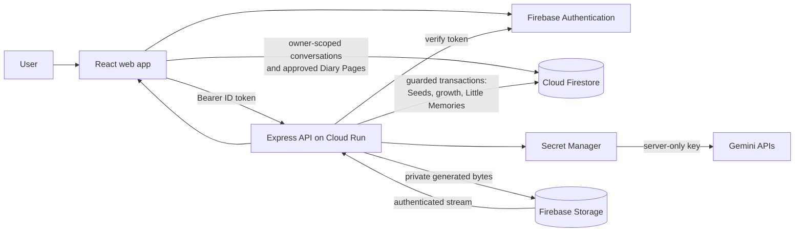

# Pocket Familiar

### A little companion who sees your day — and helps you keep only what you choose.


| | |
|---|---|
| **Challenge** | Ideathon Prototype · `#AccelerateAIwithCloudRun` |
| **Live app** | [Open Pocket Familiar](https://pocket-familiar-722689570272.asia-south1.run.app) |
| **Release** | `a57ab11` · Cloud Run `asia-south1` |
| **Built with** | Gemini · Firebase · Cloud Run · React |

Pocket Familiar looks like a gentle fantasy game. Underneath, it is a rigorously bounded
AI journaling system: user-authored history stays distinct from model suggestions, every
lasting memory requires consent, and generated illustrations remain private.

---

## Why Pocket Familiar exists

**AI chat can talk, but its history is not a diary. A diary can record, but it cannot talk back.**

Pocket Familiar joins the two. Midnight, a small familiar, accompanies everyday life with
short reflective conversations. It remembers when things happened, helps the user shape a
day into a diary page, and can interpret a chosen moment without pretending its interpretation
was the user's own memory.

The goal is not an endlessly talking chatbot. It is the feeling that a small companion noticed
the day with you — and helped you keep it honestly.

## The moment to remember: Little Memories

A conversation can become a Diary Page. A page can yield a Memory Seed. When the user chooses
a page and active seeds, Pocket Familiar drafts a bounded scene brief for review. Only after the
user edits and approves that brief does Gemini create a private **Little Memory** illustration.

The result is more than a random AI image: it is a small visual keepsake grounded in records the
user deliberately chose. The familiar has seen the same moment, interpreted it gently, and
turned it into something the user can revisit or share as a branded memory card.

## The journey

1. **Write freely.** The user's turn is stored before Gemini is called, so a provider failure never erases it.
2. **Talk it through.** Midnight offers a short reflection, summary, brainstorm, or action plan.
3. **Press it into a page.** The user chooses only their own turns, reviews the AI-assisted draft, edits it, and explicitly saves it.
4. **Choose what may be remembered.** Memory Seeds are proposed one at a time; the user can approve, edit, revoke, or delete them.
5. **Watch the familiar grow.** A user-initiated ceremony can move Midnight from Companion to Keeper when accepted memory evidence exists.
6. **Enter the Memory Room.** Conversations, Diary Pages, active or revoked Seeds, and Little Memories remain searchable with exact provenance.
7. **Create a Little Memory.** An approved scene brief automatically starts one private illustration attempt; failures stay honest and retryable.

## Development journey

Pocket Familiar began with the official Google AI Studio journaling codelab. It provided a clear,
practical foundation for Gemini-powered reflection, allowing us to concentrate on the surrounding
product experience: consent, provenance, familiar growth, Living Memory, private illustration,
and an interface with its own identity. From that foundation, the submitted product grew through
eight reviewed milestones. The commits below mark accepted checkpoints rather than every small
corrective pass.

| Milestone | Accepted checkpoint | What changed |
|---|---:|---|
| **1. Establish the AI Studio foundation** | `cb1b88e` | Archived the supplied ZIP byte-for-byte as a verifiable starting point, then began adapting its development-oriented structure for a production Cloud Run environment. |
| **2. Build the safety skeleton** | `16da160` | Adapted the foundation for Cloud Run production, then added exact project binding, verified Firebase tokens, raw-save-first durability, bounded Gemini fallback, deterministic response contracts, secret scanning, and automated tests. |
| **3. Give consent a visible workflow** | `9efb292` | Added “Press into today’s page”: only selected user-authored turns can become an AI-assisted Diary Page, and nothing is saved until the user reviews it. |
| **4. Make the familiar part of the real flow** | `71bdc7c` | Connected Midnight’s states to actual save, retry, failure, and celebration events instead of a decorative animation state table. |
| **5. Turn the prototype into a product** | `2886e66` | Rebuilt the interface around the illustrated Pocket Familiar language, added full Diary reading, provenance columns, honest export, and browser interaction evidence. |
| **6. Grow roots and a memory room** | `6eb1217` → `c12780d` | Added consent-based Memory Seeds, Companion-to-Keeper growth, and a deterministic Living Memory projection over existing records without inventing a second source of truth. |
| **7. Create the Little Memory foundation** | `e0b1902` | Added the approved scene-brief workflow, exact source provenance, retry-stable IDs, and deletion plans that preserve or update downstream truth. No illustration was claimed before one existed. |
| **8. Generate and release the keepsake** | `a57ab11` | Added authenticated private image generation and Storage delivery, automatic generation after explicit brief approval, shareable memory cards, responsive QA, calmer 30% question behavior, and the final production release. |

### What the iterations taught us

- **A good scaffold creates room for product invention.** The AI Studio foundation let us spend more of the build on consent, memory ownership, familiar growth, and the Little Memory experience.
- **Consent must be symmetric.** If a user explicitly approves a memory into existence, deletion must also expose what depends on it and let the user decide what remains.
- **Prompting is not enforcement.** Word limits, question frequency, JSON shape, source membership, and provenance are validated by deterministic code.
- **Build the truthful state before the magical state.** Diary Pages, Seeds, and scene briefs existed as honest, retryable records before CG generation was allowed to call them illustrated memories.

## A companion that does not interrogate

Typical AI conversations end every reply with another question. Midnight does not. A stable
per-turn policy makes only 30% of reflective-chat turns eligible for at most one meaningful,
optional question. The other 70% prohibit questions and must end with a grounded reflection.
The response contract is enforced in code: a model answer that violates the selected policy is
rejected rather than silently stored.

## Why the Keeper exists

Many useful apps are abandoned after the first burst of novelty. Pocket Familiar gives return
visits a purpose: the companion changes as the user builds a history they have consciously
chosen to keep.

Growth is not a streak, a score, or an automatic reward. It is a relationship milestone backed
by accepted memories and initiated by the user. The current product includes Midnight's
Companion and Keeper forms.

---

## Trust is a product feature

Pocket Familiar is designed around one rule:

> **AI may understand and propose. The user decides whether a memory becomes real, remains, or disappears.**

The system does not promise that a language model can never be wrong. Instead, it prevents
model output from silently becoming personal history or factual authority.

### Three visibly different kinds of content

1. **User-authored** — what the user actually wrote or said.
2. **AI-assisted draft** — a proposed Diary Page, Memory Seed, or scene brief that remains unsaved until reviewed and approved.
3. **AI-generated illustration** — an image created only from an approved scene brief and labeled as generated.

### Enforced boundaries

- Invalid, malformed, or over-limit model output fails closed; it is not silently repaired into a record.
- The browser never receives the Gemini API key.
- Every protected API request carries a Firebase ID token that is verified server-side.
- Firestore paths and Security Rules isolate each user's data.
- Server-authoritative transactions protect growth, Seed mutations, deletion plans, Little Memories, and image lifecycle state.
- Source-deletion previews expose affected derivatives and use fingerprints so stale confirmation cannot delete against a changed plan.
- Generated image bytes stay in a private Storage bucket and are returned only through an authenticated owner-checked endpoint.
- Revocation is not rewritten as deletion: provenance remains truthful.

---

## Architecture



The model never writes directly to Firestore or Storage. The Firebase client SDK writes
owner-scoped conversations and approved Diary Pages under Security Rules. Operations that need
stronger authority — growth, Seed mutation, stale-safe deletion, Little Memory confirmation,
and illustration lifecycle — go through the authenticated Cloud Run API.

### Firestore data model

Records are isolated under `users/{uid}/…`:

- `interactions` — journaling conversations with timestamped turns
- `diaryPages` — user-approved Diary Pages
- `memorySeeds` — consent-based active or revoked memory statements
- `littleMemories` — approved scene briefs and illustration metadata
- `littleMemories/{id}/generations` — bounded image-attempt records
- `familiar/profile` — Companion or Keeper state

Generated image bytes are not stored in Firestore.

## Core capabilities

- Multi-turn Gemini reflection with a bounded four-model fallback ladder
- Raw-save-first journaling and idempotent retries
- User-selected Diary Page sources and explicit approval
- Consent-based Memory Seeds with edit, revoke, delete, and provenance
- Companion-to-Keeper growth ceremony
- Living Memory search across four record types without inventing a new canonical store
- Deterministic JSON and Markdown exports
- Private Gemini-generated Little Memory illustrations
- Shareable branded memory cards
- Responsive desktop and mobile interface with keyboard-accessible dialogs

## Engineering highlights

- **Deterministic contracts:** response shape, length, and per-turn question policy are checked in code, not trusted to prompt wording alone.
- **Bounded failure:** per-attempt and total model deadlines, fallbacks, and explicit failure states prevent invented recovery content.
- **Idempotency:** retries reuse preallocated identifiers; image attempts and confirms cannot quietly create duplicates.
- **Verified provenance:** server-side source re-fetching prevents a client from forging Diary Page or Seed ownership.
- **Stale-safe deletion:** plan fingerprints force re-review when affected references change.
- **Private media:** no public object URL is stored or exposed.
- **Least privilege:** Cloud Run uses a dedicated runtime service account rather than the default Compute identity.
- **Production evidence:** TypeScript, 301 automated tests, production build, secret scan, staged Cloud Run QA, and owner live QA passed for this release.

## Technology

| Area | Technology |
|---|---|
| Interface | React 19, Vite, Tailwind CSS |
| API | Express + TypeScript, bundled with esbuild |
| Authentication | Firebase Authentication · Google Sign-In |
| Database | Cloud Firestore · named database · per-user isolation |
| AI text | Gemini Flash models via `@google/genai` |
| AI image | `gemini-3.1-flash-image` |
| Secrets | Google Secret Manager |
| Private media | Firebase Storage |
| Runtime | Google Cloud Run + Cloud Native Buildpacks |

---

## Development and verification

The public product is already hosted on Cloud Run; end users do not run these commands.
This section is only for reviewers and developers who want to reproduce the source build or tests.
It requires a current Node.js LTS and npm.

```bash
npm ci
npm run lint
npm run test
npm run dev
npm run build
npm run scan:secrets
```

After `npm run build`, `npm start` serves the production assets and API.

### Environment variables

Use `.env.example` as the names-only template. Never commit real secret values.

Server-only:

- `GEMINI_API_KEY`
- `FIREBASE_PROJECT_ID`
- `PORT`
- `GEMINI_MODELS`
- `GEMINI_ATTEMPT_TIMEOUT_MS`
- `GEMINI_TOTAL_TIMEOUT_MS`
- `FIRESTORE_DATABASE_ID`
- `LITTLE_MEMORY_BUCKET`
- `GEMINI_IMAGE_MODEL`
- `GEMINI_IMAGE_ATTEMPT_TIMEOUT_MS`

Public Firebase web configuration, baked into the browser build:

- `VITE_FIREBASE_PROJECT_ID`
- `VITE_FIREBASE_API_KEY`
- `VITE_FIREBASE_AUTH_DOMAIN`
- `VITE_FIREBASE_APP_ID`
- `VITE_FIREBASE_STORAGE_BUCKET`
- `VITE_FIREBASE_MESSAGING_SENDER_ID`
- `VITE_FIRESTORE_DATABASE_ID`

The production build fails closed when required Firebase values are absent or point at an
unaccepted project.

## Firestore Security Rules

[`firestore.rules`](firestore.rules) is the checked-in policy:

- conversations are readable and writable only by their authenticated owner;
- Diary Pages require owner identity and a validated confirmed-page shape;
- Memory Seeds and Little Memories are owner-readable but deny browser writes;
- a user may create only the fixed Companion profile shape; Keeper transition is server-only;
- there is no recursive blanket grant and no `allow read, write: if true` rule.

Deploy the rules to the configured named database:

```bash
npx firebase-tools deploy --only firestore --project="$PROJECT_ID"
```

## Deploy to Cloud Run

This reviewed release is deliberately bound to its Firebase project in `server/config.ts`,
`firebase.json`, and production build checks. A fork must review and update those bindings
together rather than bypassing them.

### 1. Prepare Google Cloud and Firebase

Create a Firebase web app, enable Google Sign-In, initialize Firestore and Firebase Storage,
then enable the required APIs:

```bash
export PROJECT_ID="YOUR_PROJECT_ID"
export REGION="YOUR_CLOUD_RUN_REGION"
export SERVICE="pocket-familiar"
export RUNTIME_SA="pocket-familiar-runner@${PROJECT_ID}.iam.gserviceaccount.com"

gcloud services enable \
  run.googleapis.com \
  cloudbuild.googleapis.com \
  artifactregistry.googleapis.com \
  secretmanager.googleapis.com \
  firestore.googleapis.com \
  identitytoolkit.googleapis.com \
  iam.googleapis.com \
  --project="$PROJECT_ID"
```

### 2. Store the Gemini key and configure least privilege

```bash
gcloud iam service-accounts create pocket-familiar-runner \
  --display-name="Pocket Familiar Cloud Run" \
  --project="$PROJECT_ID"

gcloud secrets create GEMINI_API_KEY \
  --replication-policy=automatic \
  --project="$PROJECT_ID"

read -rsp "Gemini API key: " PF_GEMINI_KEY && echo
printf '%s' "$PF_GEMINI_KEY" | gcloud secrets versions add GEMINI_API_KEY \
  --data-file=- \
  --project="$PROJECT_ID"
unset PF_GEMINI_KEY

gcloud secrets add-iam-policy-binding GEMINI_API_KEY \
  --project="$PROJECT_ID" \
  --member="serviceAccount:${RUNTIME_SA}" \
  --role=roles/secretmanager.secretAccessor

gcloud projects add-iam-policy-binding "$PROJECT_ID" \
  --member="serviceAccount:${RUNTIME_SA}" \
  --role=roles/datastore.user

gcloud storage buckets add-iam-policy-binding "gs://YOUR_PRIVATE_STORAGE_BUCKET" \
  --member="serviceAccount:${RUNTIME_SA}" \
  --role=roles/storage.objectAdmin
```

### 3. Deploy

Fill the public Firebase web values from Firebase project settings. The Firebase web API key is
public configuration; never substitute the server-side Gemini key.

```bash
export FIRESTORE_DATABASE_ID="YOUR_FIRESTORE_DATABASE_ID"
export STORAGE_BUCKET="YOUR_PRIVATE_STORAGE_BUCKET"
export VITE_FIREBASE_API_KEY="YOUR_PUBLIC_FIREBASE_WEB_API_KEY"
export VITE_FIREBASE_AUTH_DOMAIN="YOUR_FIREBASE_AUTH_DOMAIN"
export VITE_FIREBASE_APP_ID="YOUR_FIREBASE_APP_ID"
export VITE_FIREBASE_MESSAGING_SENDER_ID="YOUR_MESSAGING_SENDER_ID"

gcloud run deploy "$SERVICE" \
  --source=. \
  --project="$PROJECT_ID" \
  --region="$REGION" \
  --service-account="$RUNTIME_SA" \
  --allow-unauthenticated \
  --labels=dev-tutorial=cloud-run-ai-challenge \
  --set-env-vars="FIREBASE_PROJECT_ID=${PROJECT_ID},FIRESTORE_DATABASE_ID=${FIRESTORE_DATABASE_ID},LITTLE_MEMORY_BUCKET=${STORAGE_BUCKET},GEMINI_IMAGE_MODEL=gemini-3.1-flash-image" \
  --set-secrets="GEMINI_API_KEY=GEMINI_API_KEY:latest" \
  --set-build-env-vars="VITE_FIREBASE_PROJECT_ID=${PROJECT_ID},VITE_FIREBASE_API_KEY=${VITE_FIREBASE_API_KEY},VITE_FIREBASE_AUTH_DOMAIN=${VITE_FIREBASE_AUTH_DOMAIN},VITE_FIREBASE_APP_ID=${VITE_FIREBASE_APP_ID},VITE_FIREBASE_STORAGE_BUCKET=${STORAGE_BUCKET},VITE_FIREBASE_MESSAGING_SENDER_ID=${VITE_FIREBASE_MESSAGING_SENDER_ID},VITE_FIRESTORE_DATABASE_ID=${FIRESTORE_DATABASE_ID}"
```

After deployment, add the Cloud Run hostname to Firebase Authentication's authorized domains,
deploy `firestore.rules`, verify `GET /api/health`, then complete a real signed-in owner-isolation
and Little Memory smoke test.

---

## Current limitations

- Little Memory image generation is a real model call and may take tens of seconds.
- Keeper-mode image prompting still uses Midnight's default Companion identity.
- The current release includes one familiar route and two visual growth stages.
- This prototype is not medical, crisis, or professional advice software.

## Roadmap — not implemented in this release

Pocket Familiar is designed for multiple familiar routes. A future user could begin with a
different small creature — different appearance, temperament, dialogue rhythm, and story —
then grow that same identity through later forms.

> **Personality is chosen at origin; evolution reveals it, rather than rewriting it.**

Future routes may progress beyond Keeper into more anthropomorphic forms, with character-specific
stories and wardrobes. Growth would remain a relationship reward, not a paywall placed halfway
through an existing companion's development. These routes and forms are product direction only;
they are not present in this repository or the live prototype.

## AI-assisted art disclosure

The product artwork — familiar poses, landing scene, and environmental backgrounds — was created
with OpenAI image generation under the owner's art direction, selection, and integration. In-app
Little Memory illustrations are generated with Google's `gemini-3.1-flash-image` after the user
approves and saves a scene brief.

## Copyright

**All rights reserved.** This public repository is provided for evaluation and demonstration.
No open-source license is granted.
